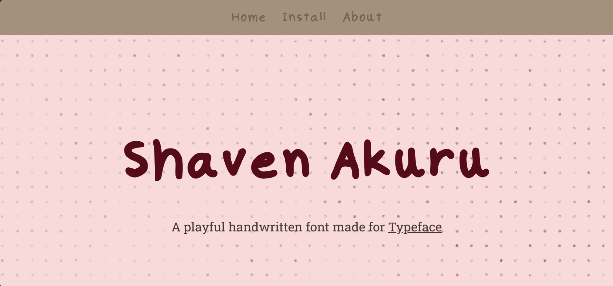

# Shaven Akuru -

## A handwritten font bult for Typeface by HackClub. The repository contains the font and the landing page for it.

# Live at *https://shavendulneth.tech/Shaven-Akuru/*

# How to run locally

- `git clone https://github.com/Shaven-Wickramanayaka/Shaven-Akuru.git`
- `cd Shaven-Akuru`
- `npm run dev` (Make sure Node.JS is isntalled on your device)

# Tech Stack

- HTML,CSS,Javascript
- Astro (Frontend)
- Tailwind CSS

# Credits

- [Caligraphr](https://www.calligraphr.com/en/)
- [How to Install Fonts on Mac](https://youtu.be/P-njy5pH5U4?si=OUliiv0ssK7zWKOg)
- [Difference between OTF and TTF](https://designerly.com/otf-vs-ttf-fonts/)
